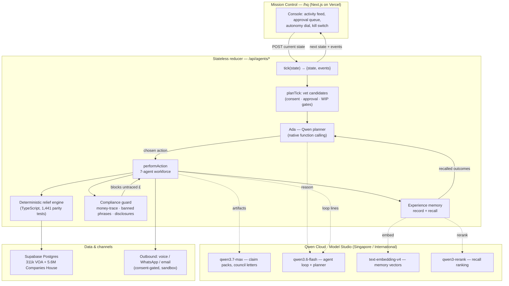

# Architecture — Stella on Qwen Cloud

Global AI Hackathon Series with Qwen Cloud · **Autopilot Agent** track.

Stella automates a real UK business workflow end-to-end — sourcing unclaimed
Small Business Rate Relief, qualifying it against a deterministic engine,
selling compliantly, and filing council applications — with structural safety
gates and a human-in-the-loop approval queue. The reasoning layer runs entirely
on **Qwen Cloud (Alibaba Cloud Model Studio)**.

## Data flow, one tick

1. The console POSTs the current world-state to `/api/agents/tick` (state lives
   client-side; the server is a **pure, replayable reducer** — no database
   needed for the autonomous demo).
2. `planTick` computes the actionable candidates, applying the consent,
   approval, and work-in-progress gates.
3. **Ada** (the Chief-of-Staff agent) picks the next action via **native Qwen
   function calling** (`qwen3.6-flash`), drawing on **recalled experience** —
   past outcomes retrieved with `text-embedding-v4` and ranked by `qwen3-rerank`.
   A null/invalid choice falls back to the deterministic priority order, so the
   loop never depends on the model.
4. The chosen agent acts. Every £ figure comes from the **deterministic relief
   engine**, never the LLM.
5. Customer/council artifacts are written by `qwen3.7-max`, then pass the
   **compliance guard** (money-trace re-derivation, banned-phrase scan, required
   disclosures) or are rewritten to a safe template and re-checked.
6. The outcome is recorded to **experience memory** for future recall.
7. Actions above the autonomy threshold pause in the **human approval queue**;
   `running=false` is a hard kill switch.

## Why this is native to Qwen Cloud

- **Four Qwen models, each for its job**: flagship `qwen3.7-max` for
  customer-facing documents; cheap high-throughput `qwen3.6-flash` for the agent
  loop and planner; `text-embedding-v4` + `qwen3-rerank` for cross-session memory.
- **Native function calling** drives the planner — not prompt-parsed prose.
- **OpenAI-compatible endpoint** (`dashscope-intl.aliyuncs.com/compatible-mode/v1`)
  via a two-tier provider seam; thinking-mode is forced off on the loop and a
  429-retry rides out the account-wide rate limit.

See [alibaba-cloud-proof.md](./alibaba-cloud-proof.md) for the deployment-proof
code pointers.
